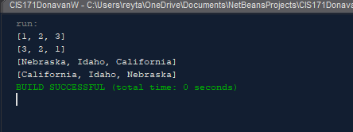

# Project Title
A prime number finder that writes the prime number array to a .dat file and reads them

## Example Output

## Analysis Steps

All prime numbers up to 10,000,000,000) Write a program that finds all prime numbers up to 10,000,000,000. There are approximately 455,052,511 such prime numbers. Your program should meet the following requirements:

Your program should store the prime numbers in a binary data file, named PrimeNumbers.dat. When a new prime number is found, the number is appended to the file.

To find whether a new number is prime, your program should load the prime numbers from the file to an array of the long type of size 10000. If no number in the array is a divisor for the new number, continue to read the next 10000 prime numbers from the data file, until a divisor is found or all numbers in the file are read. If no divisor is found, the new number is prime.

Since this program takes a long time to finish, you should run it as a batch job from a UNIX machine. If the machine is shut down and rebooted, your program should resume by using the prime numbers stored in the binary data file rather than start over from scratch.

Note:  Revise your calculations to find prime numbers to 1,000,000.  NOT 10,000,000.  And no, you do not need to do a batch job on a UNIX machine. Refer to sample code in the chapter to solve this problem.

### Design

How did you approach your program design? Did you use multiple classes to define various objects?

### Testing

i mostly used alot of print lines to show that each piece was operating correctly as well as debugging from time to time

## Notes

main issue was getting everything to work together after that it was a breeze

## Do not change content below this line
## Adapted from a README Built With

* [Dropwizard](http://www.dropwizard.io/1.0.2/docs/) - The web framework used
* [Maven](https://maven.apache.org/) - Dependency Management
* [ROME](https://rometools.github.io/rome/) - Used to generate RSS Feeds

## Contributing

Please read [CONTRIBUTING.md](https://gist.github.com/PurpleBooth/b24679402957c63ec426) for details on our code of conduct, and the process for submitting pull requests to us.

## Versioning

We use [SemVer](http://semver.org/) for versioning. For the versions available, see the [tags on this repository](https://github.com/your/project/tags). 

## Authors

* **Billie Thompson** - *Initial work* - [PurpleBooth](https://github.com/PurpleBooth)

See also the list of [contributors](https://github.com/your/project/contributors) who participated in this project.

## License

This project is licensed under the MIT License - see the [LICENSE.md](LICENSE.md) file for details

## Acknowledgments

Oscar Sanchez at MyonkYang.com mostly for helping me to realize you didnt need even numbers after 2
