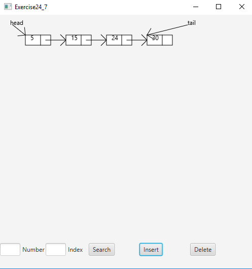

# Project Title

a project that displays the runtimes of multiple different sort algorithms

## Example Output

## Analysis Steps
Complete the following application as the hands-on portion of Exam 3.  You may use your previously written code as a reference to complete this project.  Internet is allowed.  

Write a program that obtains the execution time of selection sort, radix sort, bubble sort, merge sort, quick sort, and heap sort for input size 50000, 100,000, 150,000, 200,000, 250,000, and 300,000. Your program should create data randomly and print a table.

long startTime = System.currentTimeMillis();

perform the task;long endTime = System.currentTimeMillis();

long executionTime = endTime - startTime;

### Design

slowly testing each piece bit by bit sos everyhting worked together
### Testing

A step by step series of examples that you developed to properly test the program. 

## Notes

Explain any issues or testing instructions.

## Do not change content below this line
## Adapted from a README Built With

* [Dropwizard](http://www.dropwizard.io/1.0.2/docs/) - The web framework used
* [Maven](https://maven.apache.org/) - Dependency Management
* [ROME](https://rometools.github.io/rome/) - Used to generate RSS Feeds

## Contributing

Please read [CONTRIBUTING.md](https://gist.github.com/PurpleBooth/b24679402957c63ec426) for details on our code of conduct, and the process for submitting pull requests to us.

## Versioning

We use [SemVer](http://semver.org/) for versioning. For the versions available, see the [tags on this repository](https://github.com/your/project/tags). 

## Authors

* **Billie Thompson** - *Initial work* - [PurpleBooth](https://github.com/PurpleBooth)

See also the list of [contributors](https://github.com/your/project/contributors) who participated in this project.

## License

This project is licensed under the MIT License - see the [LICENSE.md](LICENSE.md) file for details

## Acknowledgments

* Hat tip to anyone who's code was used
* Inspiration
* etc
