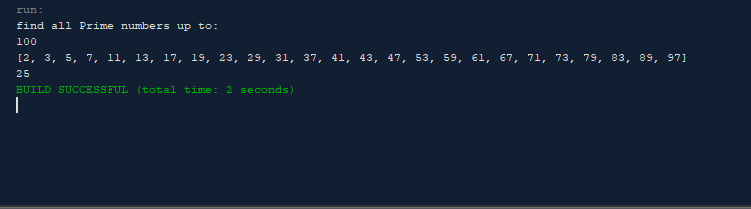

# Exercise 16.13

a simple program to create a loan calculator with a GUI

If you run it youll notice that it look different from the image. Thats because when i tried to push it it reverted my project to a previous stage and forced me to start over from scratch.

## Example Output

## Analysis Steps

*16.13 (Compare loans with various interest rates) Rewrite Programming Exercise 5.21 to create a GUI, as shown in Figure 16.41b. Your program should let the user enter the loan amount and loan period in the number of years from text fields, and it should display the monthly and total payments for each interest rate starting from 5 percent to 8 percent, with increments of one-eighth, in a text area. 

### Design

i made it simple focusing on the rquirements

### Testing

i finished each part individually and tested them as they parts were finished
Give the example
## Notes

## Do not change content below this line
## Adapted from a README Built With

* [Dropwizard](http://www.dropwizard.io/1.0.2/docs/) - The web framework used
* [Maven](https://maven.apache.org/) - Dependency Management
* [ROME](https://rometools.github.io/rome/) - Used to generate RSS Feeds

## Contributing

Please read [CONTRIBUTING.md](https://gist.github.com/PurpleBooth/b24679402957c63ec426) for details on our code of conduct, and the process for submitting pull requests to us.

## Versioning

We use [SemVer](http://semver.org/) for versioning. For the versions available, see the [tags on this repository](https://github.com/your/project/tags). 

## Authors

* **Billie Thompson** - *Initial work* - [PurpleBooth](https://github.com/PurpleBooth)

See also the list of [contributors](https://github.com/your/project/contributors) who participated in this project.

## License

This project is licensed under the MIT License - see the [LICENSE.md](LICENSE.md) file for details

## Acknowledgments

* Hat tip to anyone who's code was used
* Inspiration
* etc
